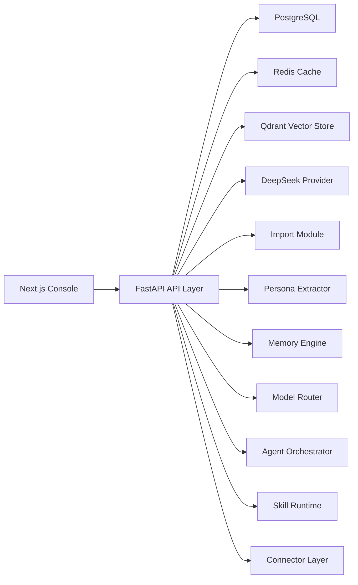

# Personal Agent Platform Architecture

## 1. Goals

一期聚焦“能跑起来的统一 Agent 平台 MVP”，核心目标是把人格、记忆、模型、技能、连接器收敛到同一个工作台里，优先保证链路闭环：

1. 数据导入
2. 标准化与 Persona 抽取
3. 长期记忆写入与检索
4. 对话编排与模型响应
5. 前端统一配置与管理

## 2. Non-Goals

- 暂不实现复杂权限体系与团队协作
- 暂不实现生产级分布式任务编排
- 暂不接入多家模型供应商，只保留路由扩展点
- 暂不实现完整 Feishu OAuth 流程，但一期已经交付可运行的 Feishu receive/reply MVP（webhook + OpenAPI）

## 3. High-Level Architecture



## 4. Core Domains

### 4.1 Import Domain

- 输入：`txt` / `csv` / `json`
- 输出：统一标准化消息结构 `NormalizedMessage`
- 能力：解析、预览、提交入库、供 Persona 与 Memory 复用

### 4.2 Persona Domain

- 从标准化语料中提取风格特征
- 形成可编辑的 Persona Card
- 后续为系统 prompt、路由策略、回复风格提供输入

### 4.3 Memory Domain

- `session`: 当前对话临时记忆
- `episodic`: 事件与交互片段
- `semantic`: 稳定事实与偏好
- `instruction`: 明确规则与长期要求

PostgreSQL 保存权威数据，Qdrant 保存检索向量索引，二者通过 `vector_id` 关联。

### 4.4 Model Routing Domain

- 统一 provider 接口
- 当前实现 `DeepSeekProvider`
- 预留 streaming、tool calling、fallback provider 扩展能力

### 4.5 Agent Orchestration Domain

完整链路：

1. 读取 persona
2. 拉取 recent context
3. 检索相关 memories
4. 获取 active skills
5. 组织 prompt
6. 调用模型
7. 如有 tool calls 则执行 skill runtime
8. 写回消息与记忆

### 4.6 Connector Domain

当前已经交付可运行的 Feishu Connector MVP，包含 webhook 接收、verification token 校验、conversation mapping、delivery log、mock/live 双模式以及 OpenAPI 回复路径。整体仍然抽象成统一 `connectors` 表与 runtime 接口，便于后续扩展到微信、Telegram、Email 等平台。

## 5. Monorepo Layout

```text
apps/
  api/
    app/
      api/
      core/
      db/
      models/
      schemas/
      services/
  web/
    app/
    components/
    lib/
packages/
  shared/
docs/
  adrs/
```

## 6. Data Flow

### 导入到 Persona

1. 前端上传文件
2. API 解析并返回预览
3. 用户确认后提交入库
4. Persona Extractor 从 `normalized_messages` 读取语料生成 Persona Card

### 对话到记忆

1. 用户发起聊天
2. Orchestrator 组合 persona + recent messages + retrieved memories
3. Model Router 调用 DeepSeek
4. Runtime 执行技能
5. 对话结果回写 `messages` 与 `memories`

## 7. Key Decisions

- 采用模块化单体而不是微服务：MVP 阶段开发和部署成本最低
- 使用 PostgreSQL 作为核心事实库：适合强 schema 与审计
- 使用 Qdrant 作为向量检索层：便于记忆检索和后续 RAG 能力
- 前后端共享 schema 放入 `packages/shared`：减少类型漂移
- Skill Runtime 以“注册器 + manifest”实现：先统一接口，再逐步增强执行能力

## 8. Extensibility Points

- `BaseModelProvider`: 支持新增 OpenAI / Anthropic / Gemini
- `BaseConnectorRuntime`: 支持新增 Feishu 之外的平台
- `BaseSkillHandler`: 支持新增本地工具或远程工具
- `MemoryEmbeddingProvider`: 支持从本地哈希 embedding 切换到真实 embedding 服务

## 9. Risks and Mitigations

- DeepSeek API 不可用：保留 fallback mock 响应路径，确保调试不中断
- 向量能力不足：当前默认使用 deterministic hash embedding，后续可平滑替换
- 导入格式差异大：先统一成 adapter 模式，逐步增加格式识别规则
- 前后端联调复杂：所有 API 使用显式 Pydantic schema，避免隐式字段

## 10. Stage Outcome

当前实现目标是交付一个本地可运行、结构清晰、可持续扩展的 MVP，而不是一次性做完生产系统。后续迭代可以围绕连接器、任务调度、身份认证、真实技能执行沙箱继续增强。
